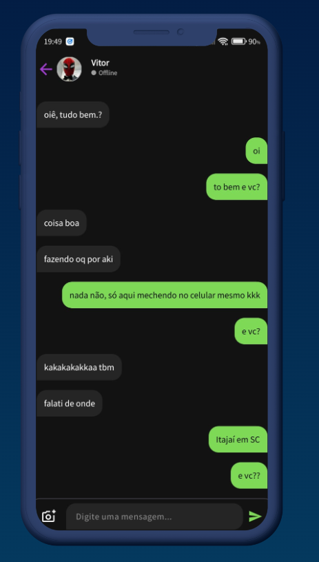
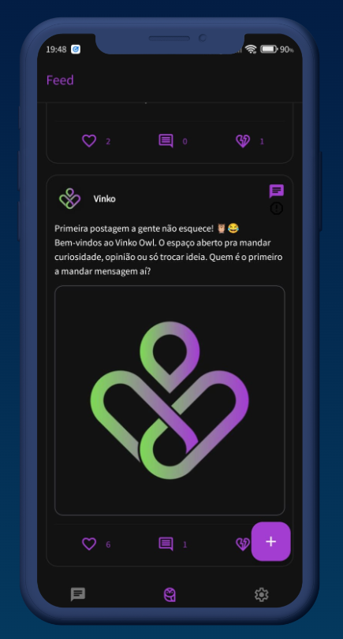
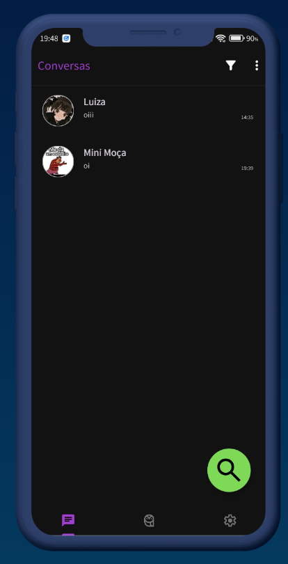

# VINKO - Random Chat App

O VINKO é um aplicativo de chat aleatório em tempo real desenvolvido para Android. O projeto foca em alta performance de mensagens e uma interface intuitiva para conexão entre usuários.

## 🚀 Tecnologias Utilizadas
* **Linguagens**: Kotlin.
* **Backend BaaS**: Firebase (Auth, Realtime Database, Cloud Messaging, Functions, Firestore, Storage).
* **UI**: Material Design components.

## ✨ Funcionalidades Principais
* Autenticação segura via Firebase Auth.
* Troca de mensagens em tempo real com baixa latência.
* Sistema de matchmaking para chats aleatórios.
* Sistema de Feed, tipo o X antigo twitter
* Notificações push integradas.

## 🛠️ Desafios Técnicos Superados
Neste projeto, foquei em garantir que a sincronização do banco de dados em tempo real não gerasse gargalos de performance no dispositivo do usuário, aplicando padrões de observabilidade do Android Jetpack.

## 📸 Screenshots

  
  
   

---
**Nota**: O código-fonte deste projeto é privado por razões de propriedade intelectual. Para uma demonstração técnica ou análise de trechos específicos do código, sinta-se à vontade para entrar em contato.

